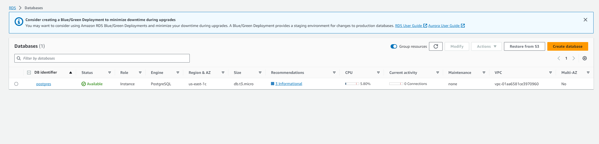
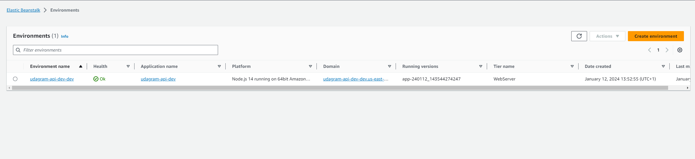
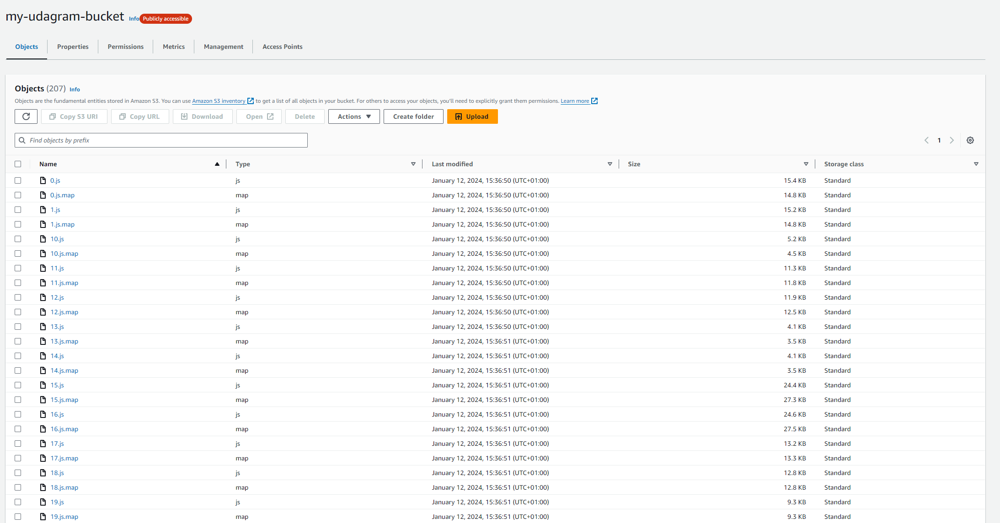
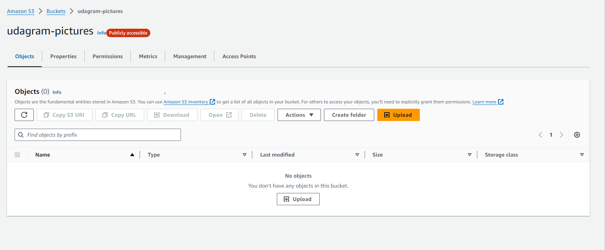
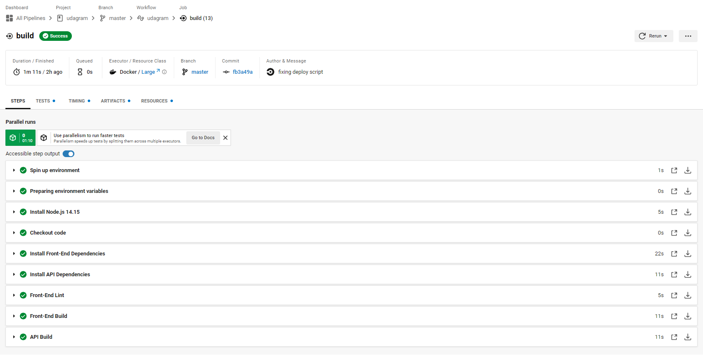
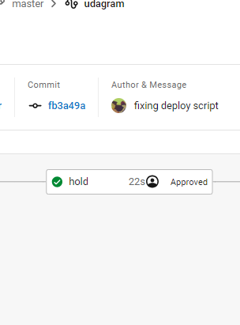
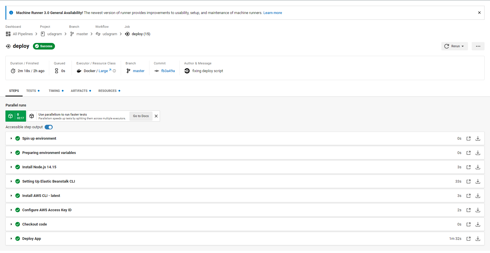
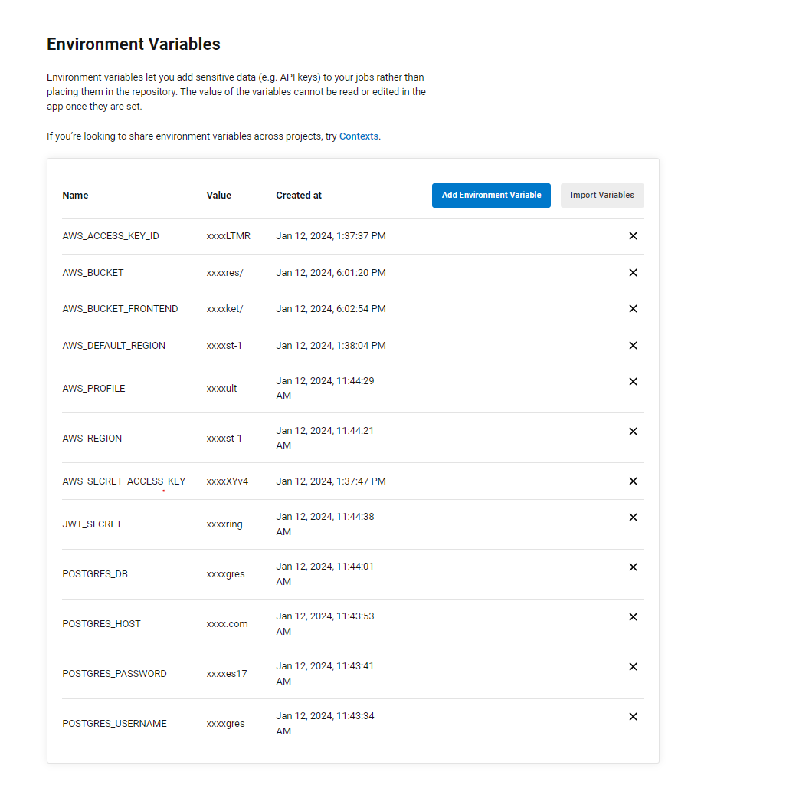
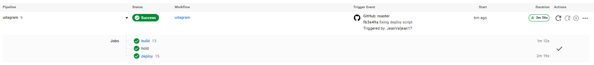

# UDAGRAM - Hosting a Full-Stack Application

This project is part of the course Deployment Process from udacity. Application is available in following link:

http://my-udagram-bucket.s3-website-us-east-1.amazonaws.com/home

## Screenshots

### AWS RDS Database

### AWS ElasticBeanstalk

### AWS S3 Frontend

### AWS S3 Pictures

###  CircleCI

