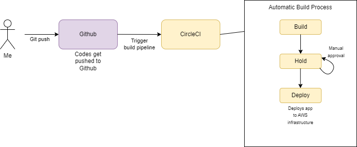

# Pipeline Process

## Build 

* Prepares environment variables
* Installs Node JS
* Pulls code from Github
* Install all dependencies for Frontend and Backend
* Builds frontend and backend

## Hold

* After build process pipelines waits for our manual approval before deploying

## Deployment

* Gets Secrets from environment variables configured in settings of CircleCI project
* Installs Node JS
* Set ups CLI tools. Such as AWS CLI and EB
* Configures AWS CLI with Access Keys provided in environment variables
* Pulls our code from Github
* Runs npm run frontend:deploy and npm run api:deploy to deploy these apps to their respective AWS Services.

## Build Pipeline Process Diagram

